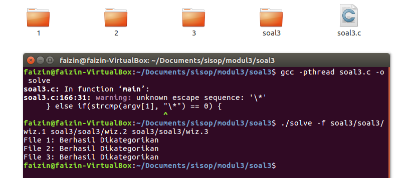
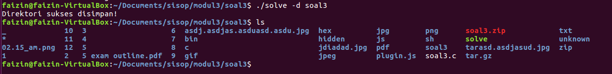
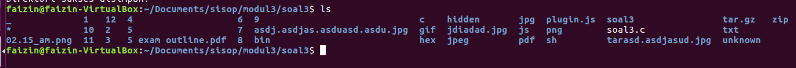

# Kelompok C04 Modul 3 Sistem Operasi C
- I Kadek Agus Ariesta Putra 05111940000105
- Muhammad Arif Faizin 05111940000060
- Ahmad Lamaul Farid 05111940000134

# Soal
Link soal [Soal Shift 3](https://docs.google.com/document/d/1ud1JyncoSDAo5hA03wPvjn7QBHPUeUG1eBJ8ETtq2dQ/edit)

## Soal 1
## Soal 2
## Soal 3
Pada soal no 3, diminta untuk membuat program dengan kriteria berikut :
* Memindahkan file ke folder dengan nama sesuai dengan ekstensinya, sesuai dengan command yang diberikan sebagai berikut :
    * menggunakan parameter `-f` untuk menerima input beberapa file. Contoh `./soal3 -f path/to/file.extension [path/to/file2.extension] ...` Apabila menggunakan parameter ini, semua file yang dicantumkan akan dipindahkan sesuai dengan jenis ekstensinya pada *working directory*.
    * menggunakan parameter `-d` untuk menerima input berupa path dari satu folder. Contoh `./soal3 -d path/to/directory`. Apabila menggunakan parameter ini, semua file yang ada pada directory akan otomatis dipindahkan dan dikategorikan secara rekursif sesuai dengan ekstensi masing-masing file.
    * menggunakan parameter tambahan `\*` untuk memindahkan dan mengkategorikan seluruh file yang ada pada *working directory*. Contoh `./soal3 \*`.
* Apabila terdapat dua ekstensi atau lebih pada satu file, maka file akan dipindahkan ke ekstensi paling depan. Contoh apabila file memiliki ekstensi `.tar.gz` maka akan dipindahkan ke folder dengan ekstensi `tar.gz`.
* Untuk file yang hidden (tidak memiliki nama file atau nama file didahului dengan titik '.') akan dipindahkan ke folder "hidden".
* Untuk file yang tidak memiliki ekstensi akan dipindahkan ke folder "unknown".
* Semua proses pindah memindah dilakukan dalam thread tersendiri agar proses berjalan cepat

Untuk menyelesaikan kriteria tersebut, maka program utama pada soal 3 ini sebagai berikut 
```c
int main(int argc, char const *argv[])
{
    getcwd(curPath, sizeof(curPath));
    if(strcmp(argv[1], "-f") == 0) {
        ...
    } else if(strcmp(argv[1], "-d") == 0) {
        ...
    } else if(strcmp(argv[1], "\*") == 0) {
        ...
    }
    return 0;
}
```
Pada program utama soal, program akan membaca argumen dari program yang dijalankan, kemudian membaginya sesuai dengan kriteria di atas.

Kemudian program akan terbagi menjadi beberapa bagian :

### A
Untuk menjawab bagian ini, perlu sebuah fungsi untuk mengecek apakah path yang di cek merupakan file atau folder. Untuk mengeceknya maka akan menggunakan fungsi `checkFile(const char *path)` sebagai berikut 
```c
int checkFile(const char *path) {
    struct stat stat_path;
    stat(path, &stat_path);
    return S_ISREG(stat_path.st_mode);
}
```
Fungsi tersebut akan mengetahui apakah file tersebut valid dengan menggunakan fungsi `S_ISREG()` apabila file tersebut tidak valid akan mengembalikan nilai `0` atau `false`.

Kemudian untuk mengkategorikan sebuah file, program ini juga akan menggunakan fungsi `filterFile()` sebagai berikut.
```c
void *filterFile(void *filePath) {
    char *ptr_ext;
    char ext[100];
    char currPath[1000];
    char oldFile[500];

    ptr_ext = strchr(filePath, '.');

    ext[0] = '\0';
    if(ptr_ext) {
        ptr_ext++;
        for(int i=0; i<strlen(ptr_ext); i++) {
            ext[i] = tolower(ptr_ext[i]);
        }
        ext[strlen(ptr_ext)] = '\0';
    }

    strcpy(oldFile, filePath);
    strcpy(currPath, curPath);
    char *fileName = strrchr(filePath, '/');

    memmove(&fileName[0], &fileName[1], strlen(fileName) - 0);


    if(fileName[0] == '.') {
        mkdir("hidden", 0777);
        strcat(currPath, "/hidden/");
        strcat(currPath, fileName);
        rename(oldFile, currPath);
    } else {
        if(strlen(ext) > 0 ) {
            mkdir(ext, 0777);
            strcat(currPath, "/");
            strcat(currPath, ext);
            strcat(currPath, "/");
            strcat(currPath, fileName);
            rename(oldFile,currPath);
        } else {
            mkdir("unknown", 0777);
            strcat(currPath, "/unknown/");
            strcat(currPath, fileName);
            rename(oldFile,currPath);
        }
    }
}
```
Fungsi ini akan menerima parameter berupa pointer dari nama path yang diinputkan. Kemudian untuk mendapatkan ekstensi dari file dari yang paling depan, maka program menggunakan fungsi `strchr()` untuk mengembalikan pointer dimana posisi character '.' pertama kali ditemukan.
Kemudian untuk mengubahnya ke dalam lowercase, dapat menggunakan fungsi `tolower` dari library `string.h`.

Selain menentukan ekstensi, di sini kita juga harus menentukan apakah file tersebut termasuk file hidden atau tidak, dengan menggunakan fungsi `strrchr()` untuk mengembalikan pointer dimana posisi character '/' terakhir ditemukan dari path. Apabila hasil dari pointer tersebut diawali dengan character '.', maka otomatis file tersebut merupakan file hidden.

Kemudian, program akan membuat direktori baru dengan menggunakan fungsi `mkdir()` untuk membuat folder.

File yang memiliki awalan "." akan dipindahkan ke folder "hidden", sedangkan file tanpa ekstensi akan dipindahkan ke folder "unknown", dan sisanya akan dipindahkan sesuai dengan ekstensi masing-masing.

Kemudian pada program utama akan melakukan looping dari argumen ke-3 hingga argumen terakhir untuk mendapatkan path file yang akan dipindahkan. 
```c
int main(int argc, char const *argv[])
{
    getcwd(curPath, sizeof(curPath));
    if(strcmp(argv[1], "-f") == 0) {
        if(argc <= 2) {
            printf("Argument tidak sesuai\n");
            exit(1);
        }
        pthread_t tid[argc-2];
        int count=0;
        char filePath[argc-2][2000];
        for(int i=2; i<argc; i++) {
            strcpy(filePath[count], argv[i]);

            if(checkFile(filePath[count])) {
                pthread_create(&tid[count], NULL, filterFile, (void *)filePath[count]);
                count++;
                printf("File %d: Berhasil Dikategorikan\n", i-1);
                
            } else {
                printf("File %d: Sad, gagal :(\n", i-1);
            }
        }
        for(int i=0; i<count; i++) {
            pthread_join(tid[i], NULL);
        }
    } else if(strcmp(argv[1], "-d") == 0) {
    ...
    } else if(strcmp(argv[1], "\*") == 0) {
    ...
    }
    return 0;
}
```

Lalu pada masing-amsing path file akan di cek satu per satu menggunakan fungsi `checkFile()`. Apabila tidak valid, program akan mencetak `File [n]: Sad, gagal :(`. Apabila valid, maka kemudian program akan membuat thread baru untuk menjalankan fungsi `filterFIle()` untuk mengkategorikan file.

Apabila telah berhasil membuat thread, maka program akan mencetak `File [n]: Berhasil Dikategorikan`.

Kemudian program akan melakukan looping pada seluruh thread untuk dilakukan join menggunakan fungsi `pthread_join()` agar tidak terjadi error pada thread selanjutnya.

Berikut dokumentasi dari bagian A



### B
Untuk menjawab bagian ini, perlu fungsi untuk melakukan rekursi dari path sebuah folder, yaitu menggunakan fungsi `filterDir()` sebagai berikut 
```c
void filterDir(char *basePath, int threadSize) {
    char path[500][500], thisCode[500];
    DIR *directory = opendir(basePath);
    struct dirent *dirent_ptr;
    pthread_t tid[threadSize];
    int count=0;

    if(!directory) {
        return;
    }

    while((dirent_ptr = readdir(directory)) != NULL) {
        strcpy(path[count], basePath);
        strcat(path[count], "/");
        strcat(path[count], dirent_ptr->d_name);
        if(dirent_ptr->d_type == DT_REG) {
            strcpy(thisCode, basePath);
            strcat(thisCode, "/soal3.c");
            if(strcmp(path[count], thisCode) != 0) {
                pthread_create(&tid[count], NULL, filterFile, (void *)path[count]);
                
                count++;
            }
        } else if((dirent_ptr->d_type == DT_DIR) && (strcmp(dirent_ptr->d_name, ".") != 0)
                    && (strcmp(dirent_ptr->d_name, "..") != 0)) {
            
            DIR *directory2 = opendir(path[count]);
            struct dirent *dirent_ptr2;
            int threadSize2=0;
            while((dirent_ptr2 = readdir(directory2)) != NULL) {
                if(dirent_ptr2->d_type == DT_REG) {
                    threadSize2++;
                }
            }
            filterDir(path[count], threadSize2);
            closedir(directory2);
        }
    }

    for(int i=0; i<threadSize; i++) {
        pthread_join(tid[i], NULL);
    }

    closedir(directory);
}
``` 
Fungsi tersebut akan menerima 2 paramter, yakni path folder yang akan direkursi dan banyak thread yang akan dibuat. Kemudian fungsi ini akan mengecek terlebih dahulu apakah folder atau file tersebut valid atau tidak. Apabila valid, kemudian fungsi akan mengecek apakah path tersebut berbentuk folder atau file menggunakan atribut `d_type` dari path tersebut. 

Apabila berupa `DT_REG` berarti merupakan sebuah file, maka fungsi akan membuat thread baru untuk mengkategorikan file tersebut dengan memanggil fungsi `filterFile()`. Sekaligus sebelumnya, dilakukan pengecekan apakah file yang dibaca merupakan file kode program c nya sendiri atau bukan, agar file kode program tidak ikut terpindahkan.

Kemudian, apabila tipe program berupa `DT_DIR`, berarti path tersebut merupakan sebuah direktori. Kemudian dicek lagi, apakah path tersebut bukan merupakan direktori '.' (direktori itu sendiri) dan juga bukan direktori '..' (direktori *parent*). Apabila telah lolos, maka baru dilakukan looping kembali pada direktori tersebut untuk menentukan ukuran thread pada child folder. Lalu panggil fungsi `filterDir()` lagi untuk melakukan rekursi pada folder childnya. 

Terakhir, lakukan join pada semua thread yang telah dibuat agar tidak terjadi error lagi.

Kemudian, pada fungsi utama program akan mengecek terlebih dahulu jumlah argumen yang diinputkan, apabila tidak sesuai akan mencetak "Argumen tidak sesuai". Apabila lolos, path yang diinput akan dicek terlebih dahulu apakah merupakan folder atau file yang valid atau bukan. 

Apabila bukan merupakan folder yang valid, maka akan mencetak "Yah, gagal disimpan :(". Namun apabila merupakan folder yang valid, maka program akan menghitung jumlah thread yang akan dibuat berdasarkan dengan jumlah child dari folder tersebut. Kemudian akan memanggil fungsi `filterDir()` untuk mengkategorikan direktori.
```c
int main(int argc, char const *argv[])
{
    getcwd(curPath, sizeof(curPath));
    if(strcmp(argv[1], "-f") == 0) {
        ...
    } else if(strcmp(argv[1], "-d") == 0) {
        char folderPath[400];
        strcpy(folderPath, argv[2]);

        if(argc <= 2) {
            printf("Argument tidak sesuai\n");
            exit(1);
        }
        DIR *fd = opendir(argv[2]);

        if(fd) {
            struct dirent *dp;
            int threadSize=0;

            while((dp = readdir(fd)) != NULL) {
                if(dp->d_type == DT_REG) {
                    threadSize++;
                }
            }
            filterDir(folderPath, threadSize);
            closedir(fd);
            printf("Direktori sukses disimpan!\n");
        } else if(ENOENT == errno) {
            printf("Yah, gagal disimpan :(\n");
        }
    } else if(strcmp(argv[1], "\*") == 0) {
        ...
    }
    return 0;
}
```

Berikut dokumentasi dari bagian B



### C
Untuk menyelesaikan bagian ini, hampir sama dengan bagian B. Hanya saja, parameter yang diterima yaitu character `\*` saja. 
```c
int main(int argc, char const *argv[])
{
    getcwd(curPath, sizeof(curPath));
    if(strcmp(argv[1], "-f") == 0) {
        ...
    } else if(strcmp(argv[1], "-d") == 0) {
        ...
    } else if(strcmp(argv[1], "\*") == 0) {
        DIR *fd = opendir(curPath);
        struct dirent *dp;
        int threadSize=0;
        if(fd) {
            struct dirent *dp;
            int threadSize=0;

            while((dp = readdir(fd)) != NULL) {
                if(dp->d_type == DT_REG) {
                    threadSize++;
                }
            }
            filterDir(curPath, threadSize);
            closedir(fd);
            printf("Direktori sukses disimpan!\n");
        } else if(ENOENT == errno) {
            printf("Yah, gagal disimpan :(\n");
        }
    }
    return 0;
}
```
Perbedaannya dengan bagian B, pada fungsi `filterDir()`, parameter yang digunakan adalah working directory yang telah didapatkan di awal program utama.

Berikut dokumentasi dari bagian C



## Kesulitan
Kesulitan dalam pengerjaan praktikum ini adalah untuk mengecek apakah outputan dari program telah sesuai atau tidak harus mengecek satu per satu, dan hal itu memakan waktu yang cukup banyak